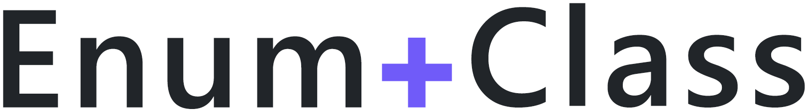

<p align="center">
  
</p>

# Introduction

This is an analyzer-only package that aims to provide a dead simple, yet complete, "discriminated unions" experience for C# with compile-time exhaustiveness checking.

"Enum classes" are a generalization of C#'s native `enums`. They can be used to represent a fixed, predefined set of possible values. Unlike regular `enum`s, "enum classes" can also store additional data per variant.

It is loosely based on the [C# proposal](https://github.com/dotnet/csharplang/blob/main/proposals/discriminated-unions.md). The proposed future syntax:
```cs
public enum class Shape
{
    Circle(float Radius),
    Rectangle(float Width, float Length),
    Triangle(float SideLength),
}
```

Unfortunately, since we don't live in the future, this is the actual syntax we'll be working with today:
```cs
[EnumClass]
public abstract record Shape
{
    private Shape() {}

    public record Circle(float Radius) : Shape;
    public record Rectangle(float Width, float Length) : Shape;
    public record Triangle(float SideLength) : Shape;
}
```

A bit more verbose, but close enough... ;) FYI, this package comes bundled with automatic code fixers to help write some of this boilerplate for you.

## Installation

[](https://www.nuget.org/packages/Badeend.EnumClass) [](https://www.nuget.org/packages/Badeend.EnumClass.Reflection) [](https://www.nuget.org/packages/Badeend.EnumClass.SystemTextJson)

```sh
dotnet add package Badeend.EnumClass

# Optional:
dotnet add package Badeend.EnumClass.Reflection
dotnet add package Badeend.EnumClass.SystemTextJson
```

## More introduction

All the magic happens at compile-time, as part of the analyzers shipped with this package.

Continuing with the example from above:
- We define a `Shape` "enum" type, that has three "case" types: `Circle`, `Rectangle` & `Triangle`.
- The `Shape` type has an `[EnumClass]` attribute, which is the cue for the analyzers to kick in.
- The analyzers enforce that the base type and nested subtypes satisfy all the required criteria for them to be worthy of the title "enum class". Some of these criteria can be seen right there in the example: `abstract` base type, private constructor, cases extend their parent type, etc... All for the ultimate goal:
- `Shape` is now **guarded against external extension** and we can be sure that any `Shape` instance we encounter at runtime will be: either a `Circle`, a `Rectangle` or a `Triangle`. Exactly one those three and _nothing more_.

Given that all the subtypes/cases are known at compile-time, we can enforce that any `switch`-expression/statement on them is **exhaustive**. I.e. we can warn developers when they've missed a case and provide them with a codefix to automatically add those missing cases. This may sound menial at first, but it can significantly improve the robustness of your application!
